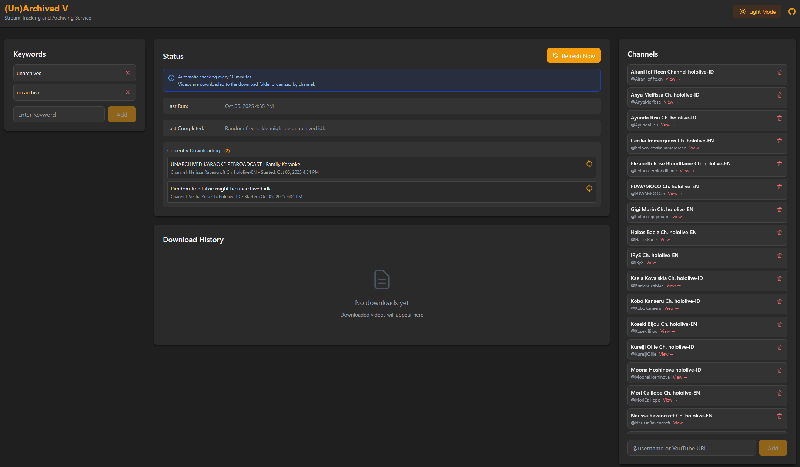

[](https://github.com/jasonyang-ee/ArchivedV/actions/workflows/test.yml)
[](https://github.com/jasonyang-ee/ArchivedV/actions/workflows/release.yml)


<h1 align="center">(Un)Archived V</h1>
<h3 align="center">Youtube Stream Download Service With Keyword Filtering.</h3>
<p align="center"></p>


## Main Purpose:

The purpose of this project is to save Vtuber singing streams where often are unarchived due to copyright issues.


## Service Feature:

1. Automatically check subscribed channels for new live streams.
2. Download matching videos based on a specified keyword list.
3. Send notifications via Pushover.
4. Manage channels and keywords via the web interface.


## Screenshot



## Public Tracking Service

This service is tracking all EN and ID branch. Video will be periodically deleted to free up space.

https://archivedv.jasony.org

## Public Docker Image

>[Docker Hub](https://hub.docker.com/r/jasonyangee/archivedv)
```
jasonyangee/archivedv:latest
```

>[GitHub Container Registry](https://github.com/jasonyang-ee/ArchivedV/pkgs/container/archivedv)
```
ghcr.io/jasonyang-ee/archivedv:latest
```

## Supported Platforms
- Linux AMD64
- Linux ARM64

## Run Using Docker Compose

```yaml
services:
  archivedv:
    image: jasonyangee/archivedv:latest
    container_name: archivedv
    restart: unless-stopped
    user: "1000:1000"
    ports:
      - "3000:3000"
    volumes:
      - ./archivedv/data:/app/data
      - ./archivedv/video:/app/download
    environment:
      TZ: America/Los_Angeles
      # PUSHOVER_APP_TOKEN: ${PUSHOVER_APP_TOKEN}
      # PUSHOVER_USER_TOKEN: ${PUSHOVER_USER_TOKEN}

		# Optional: set a custom cookies path inside the container.
		# If you don't set this, the app uses /app/data/youtube_cookies.txt
		# YTDLP_COOKIES_PATH: /app/data/youtube_cookies.txt

	 # Optional: if you want to manage cookies as a separate file on the host,
	 # mount it into the container and point YTDLP_COOKIES_PATH at it.
	 # volumes:
	 #   - ./archivedv/data:/app/data
	 #   - ./archivedv/video:/app/download
	 #   - ./archivedv/youtube_cookies.txt:/app/data/youtube_cookies.txt:ro
```

## Members-only / Private Videos (Cookies)

Some videos (members-only, private, age-restricted) cannot be downloaded by `yt-dlp` without authentication.

When this happens, ArchivedV will:

- Stop retrying that video forever.
- Mark it as **Blocked** in Download History.
- Keep it in the retry queue as **blocked until cookies are provided**.

To enable downloading those videos, provide a YouTube `cookies.txt`:

1. Export cookies from your browser (see yt-dlp docs for the latest methods):
	- https://github.com/yt-dlp/yt-dlp/wiki/FAQ#how-do-i-pass-cookies-to-yt-dlp
	- https://github.com/yt-dlp/yt-dlp/wiki/Extractors#exporting-youtube-cookies
2. Open the web UI and use the **Members-only Cookies** card:
	- Paste the full `cookies.txt` content
	- Click **Save Cookies**
	- Toggle **Enabled**

After cookies are saved/enabled, any previously blocked jobs will be unblocked and retried.

Security note: `cookies.txt` contains your account session. Only use this on a trusted machine.

## Web Interface

Access the web interface at `http://<host_ip>:3000`

## Data Persistence

Bind mounts to preserve data:

- **Configurations**: `/app/data/db.json`
- **Downloaded Videos**: `/app/download/<channel_username>/[DateTime] <video_title>/`

## Scheduling

A cron job runs every 10 minutes to check for new live streams.

## Notifications (Optional)

[Pushover](https://pushover.net/) is used to send mobile/desktop notifications on each successful download.

## Folder Permissions

It is recommended to run the container with a non-root user. The default user ID is `1000`.

Change to the user ID of your host system if necessary. You can do this by modifying the `user` field in the Docker Compose file.

## Potential Issues

- Folder permissions may cause issues. Please manually `chown` the volume bind folders to the user ID specified in the Docker Compose file.

	> Example Command
	```bash
	sudo chown -R 1000:1000 ./archivedv
	```

- Axios need ipv4 to work properly. Force ipv4 dns resolution by adding the following to your docker compose file:
	```yaml
	services:
	  archivedv:
	    image: jasonyangee/archivedv:latest
	    container_name: archivedv
	    restart: unless-stopped
	    user: "1000:1000"
	    ports:
	    - "3000:3000"
	    volumes:
	    - ./archivedv/data:/app/data
	    - ./archivedv/video:/app/download
	    environment:
	    TZ: America/Los_Angeles
	    NODE_OPTIONS: "--dns-result-order=ipv4first"
	    dns:
	    - 8.8.8.8
	    - 1.1.1.1
	    sysctls:
	    - net.ipv6.conf.all.disable_ipv6=1
	```


## Contribute

See [CONTRIBUTING.md](CONTRIBUTING.md) for development setup and contribution guidelines.
