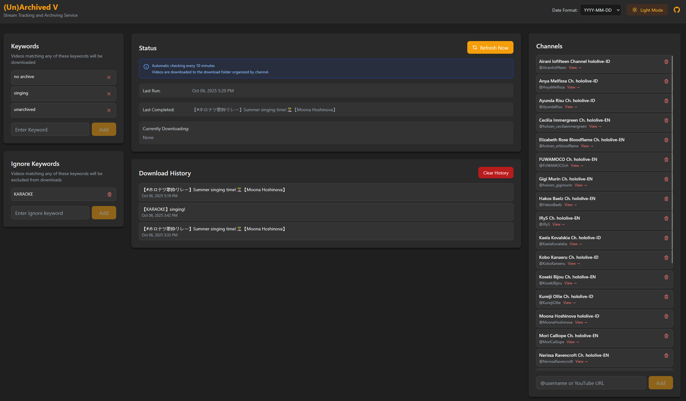

[](https://github.com/jasonyang-ee/ArchivedV/actions/workflows/test.yml)
[](https://github.com/jasonyang-ee/ArchivedV/actions/workflows/release.yml)


<h1 align="center">(Un)Archived V</h1>
<h3 align="center">Youtube Stream Download Service With Keyword Filtering.</h3>
<p align="center"></p>


## Main Purpose:

The purpose of this project is to save Vtuber singing streams where often are unarchived due to copyright issues.


## Service Feature:

1. Automatically check subscribed channels for new live streams.
2. Download matching videos based on a specified keyword list.
3. Send notifications via Pushover.
4. Manage channels and keywords via the web interface.


## Screenshot



## Public Tracking Service

This service is tracking all EN and ID branch. Video will be periodically deleted to free up space.

https://archivedv.jasony.org

## Public Docker Image

>[Docker Hub](https://hub.docker.com/r/jasonyangee/archivedv)
```
jasonyangee/archivedv:latest
```

>[GitHub Container Registry](https://github.com/jasonyang-ee/ArchivedV/pkgs/container/archivedv)
```
ghcr.io/jasonyang-ee/archivedv:latest
```

## Supported Platforms
- Linux AMD64
- Linux ARM64

## Run Using Docker Compose

```yaml
services:
  archivedv:
    image: jasonyangee/archivedv:latest
    container_name: archivedv
    restart: unless-stopped
    user: "1000:1000"
    ports:
      - "3000:3000"
    volumes:
      - ./archivedv/data:/app/data
      - ./archivedv/video:/app/download
    environment:
      TZ: America/Los_Angeles
      # PUSHOVER_APP_TOKEN: ${PUSHOVER_APP_TOKEN}
      # PUSHOVER_USER_TOKEN: ${PUSHOVER_USER_TOKEN}
```

## 🏗️ Development & Deployment

### Versioning Strategy

This project uses **Semantic Versioning** managed through `package.json`. Releases are triggered by git tags (like [pocket-id](https://github.com/pocket-id/pocket-id)).

- **MAJOR.MINOR.PATCH** format (e.g., `1.2.3`)
- Releases triggered by `v*.*.*` tags
- Docker images built for AMD64/ARM64
- GitHub releases auto-published

### CI/CD Pipeline

#### 🧪 Test Workflow (`test.yml`)
- **Trigger**: Push to main, PRs, manual
- **Purpose**: Build and validate Docker images
- **Jobs**: Build image, health check, API tests

#### 🚀 Release Workflow (`release.yml`)
- **Trigger**: Tags matching `v*.*.*`
- **Purpose**: Production release
- **Jobs**: Multi-platform build, push to registries, create GitHub release

#### ✅ PR Validation (`pr-validation.yml`)
- **Trigger**: Pull requests to main
- **Purpose**: Validate code before merge
- **Jobs**: Lint, build, quick tests

### Creating a Release

The recommended way to create releases is using the `create-release.sh` script:

```bash
# Auto-detect release type based on commits
./scripts/create-release.sh

# Force a specific release type
./scripts/create-release.sh --patch   # Bug fixes (1.2.3 → 1.2.4)
./scripts/create-release.sh --minor   # New features (1.2.3 → 1.3.0)
./scripts/create-release.sh --major   # Breaking changes (1.2.3 → 2.0.0)

# Skip confirmation prompts
./scripts/create-release.sh --minor -y
```

The script will:
1. Auto-detect release type from commit history (`feat:` → minor, `fix:` → patch)
2. Update `package.json` version
3. Add new section to `CHANGELOG.md`
4. Commit, tag, and push
5. Create a GitHub draft release

### Required GitHub Secrets

| Secret | Description |
|--------|-------------|
| `USERNAME_DOCKERHUB` | Docker Hub username |
| `TOKEN_DOCKERHUB` | Docker Hub access token |
| `GITHUB_TOKEN` | Auto-provided by GitHub Actions |

For detailed versioning documentation, see [VERSIONING.md](VERSIONING.md).

## Web Interface

Access the web interface at `http://<host_ip>:3000`

## Data Persistence

Bind mounts to preserve data:

- **Configurations**: `/app/data/db.json`
- **Downloaded Videos**: `/app/download/<channel_username>/[DateTime] <video_title>/`

## Scheduling

A cron job runs every 10 minutes to check for new live streams.

## Notifications (Optional)

[Pushover](https://pushover.net/) is used to send mobile/desktop notifications on each successful download.

## Folder Permissions

It is recommended to run the container with a non-root user. The default user ID is `1000`.

Change to the user ID of your host system if necessary. You can do this by modifying the `user` field in the Docker Compose file.

## Potential Issues

- Folder permissions may cause issues. Please manually `chown` the volume bind folders to the user ID specified in the Docker Compose file.

	> Example Command
	```bash
	sudo chown -R 1000:1000 ./archivedv
	```

- Axios need ipv4 to work properly. Force ipv4 dns resolution by adding the following to your docker compose file:
	```yaml
	services:
	  archivedv:
	    image: jasonyangee/archivedv:latest
	    container_name: archivedv
	    restart: unless-stopped
	    user: "1000:1000"
	    ports:
	    - "3000:3000"
	    volumes:
	    - ./archivedv/data:/app/data
	    - ./archivedv/video:/app/download
	    environment:
	    TZ: America/Los_Angeles
	    NODE_OPTIONS: "--dns-result-order=ipv4first"
	    dns:
	    - 8.8.8.8
	    - 1.1.1.1
	    sysctls:
	    - net.ipv6.conf.all.disable_ipv6=1
	```