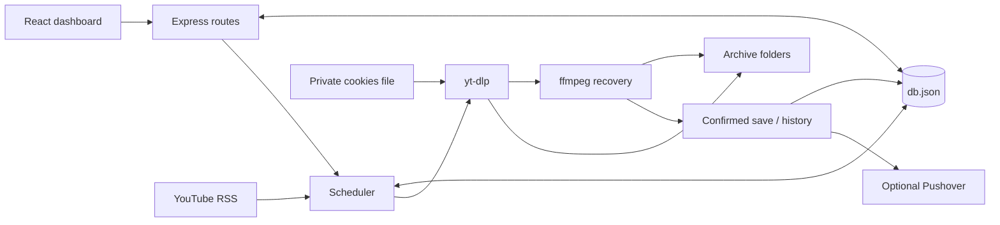

<!-- SPEC FORMAT (baked by /encode-docs — keep; makes this file self-describing)
Sections: §G goal | §C constraints | §I interfaces | §R research? | §V invariants.
Symbols: → leads to | ∴ therefore | ∀ every | ∃ exists | ! required | ? unknown/optional | ⊥ forbidden/absent | ≠ differs | ∈ member | ∉ not member | ≤ at most | ≥ at least | & and | § section.
Durable truth only. Add sparingly; correct/prune on evidence. A violated requirement is not automatically obsolete.
Address V2 as §V.2. Never renumber or reuse ids; allocate from next counters, then advance them. Deletion leaves counters unchanged.
Preserve literals, conditions, negation, uncertainty, quantities, and requirement strength.
Tables: header + delimiter row, matching columns; escape literal pipes. Empty cell = -.
next: C20 I35 R4 V41
Keep one file; prune stale/redundant facts without losing live requirements.
Full rules: /encode-docs. Compression must preserve meaning.
-->

# SPEC

## §G GOAL

(Un)Archived V monitors subscribed YouTube channels through RSS, filters titles, captures matching videos/live streams using yt-dlp, recovers separate video/audio with ffmpeg, and exposes configuration, current activity, scheduled streams and history through a React dashboard.

Expansion priorities: consistent, accessible UI behavior; stable download identity; reliable video saving, retry, cancellation and restart recovery. Preserve existing archives and configuration. Describe confirmed behavior separately from limits and future acceptance requirements; ⊥ imply that a process exit or a history entry proves a complete broadcast.

## §C CONSTRAINTS

id|description
|---|---|
C1|Node.js ≥24; application JavaScript uses ES modules (`"type":"module"`); PostCSS tooling retains `postcss.config.cjs`
C2|React 19 + Vite 7 frontend; Tailwind CSS 4 with CSS theme in `client/src/index.css`
C3|JSON flat-file store at `{cwd}/data/db.json`; ⊥ SQL/external DB
C4|Host/runtime supplies yt-dlp, ffmpeg, Python and Node; media operations use argument-array subprocesses, ⊥ shell-interpolated user commands
C5|One server process owns each data/download volume; ⊥ multiple workers, distributed queue or concurrent server writers
C6|Discovery uses YouTube channel RSS (`https://www.youtube.com/feeds/videos.xml?channel_id=`); ⊥ arbitrary feed providers
C7|Default capture: `--live-from-start --no-part --skip-unavailable-fragments --fragment-retries 50 -f bestvideo+bestaudio/best`; configurable safe options may change selection/retry tuning; completion still requires saved output
C8|YouTube account access through Netscape cookies file; ⊥ OAuth. This is source authentication, ≠ application login
C9|Archive root `{cwd}/download`; channel directory then dated title directory with video ID for new jobs; existing identified job paths retained (§I.34)
C10|HTTP port default `3000`, configurable with `PORT`; frontend development port `5173`
C11|Server modules lower camel case (`downloader.js`, `ytdlpFlags.js`); React components PascalCase
C12|Variables/functions and persisted JSON fields use camelCase; ⊥ SQL-style column naming requirement
C13|Server responsibilities remain in config, utilities, database, auth, flags, downloader, merger, scheduler, routes and entrypoint modules (§I.28); add layers only for demonstrated ownership needs
C14|UI components in `client/src/components`; shared transport/formatting in `client/src/utils`; one dashboard shell in `App.jsx`
C15|UI and API are trusted operator controls with no built-in users/roles/login. Authenticated reverse proxy + TLS required for exposure beyond a trusted network; protect both `/` and `/api` (§I.31)
C16|Downloaded media, db.json and cookies are private filesystem data; server serves built frontend only, ⊥ archive browsing, playback, media download endpoint or cookie-content GET
C17|Automated tests use disposable directories, mocked external requests and controlled subprocess fixtures; ⊥ developer's real database, credentials, channels or downloads
C18|UI must use same-origin `/api`; Vite proxies development requests. Consistency applies to visual tokens, keyboard use and loading/empty/error/success behavior, not just appearance
C19|Backward compatibility preserves existing JSON fields/history and owned media. Unknown/corrupt state must remain recoverable; ⊥ silently discard media to simplify retries

## §I INTERFACES

id|type|shape → output, purpose, condition
|---|---|---|
I1|api|`GET /api/config` → `{channels[],keywords[],ignoreKeywords[],dateFormat}`
I2|api|`POST /api/channels` `{link}` → `{id,link,username,channelName}`. Accept ASCII handle (`@` optional), HTTPS channel/handle URL or channel RSS URL; normalize to RSS; dedupe channel ID after resolution
I3|api|`DELETE /api/channels/:id` → `{success:true}`; remove subscription, retry jobs and scheduled entries. Active captures may finish; saved files/history retained
I4|api|`POST /api/keywords` `{keyword}` → `{success:true}`; trim, require nonempty string, dedupe exact stored value
I5|api|`DELETE /api/keywords/:keyword` → `{success:true}`; exact value, URL-encoded by client
I6|api|`POST /api/ignore-keywords` `{keyword}` → `{success:true}`; same validation/dedupe as positive keywords
I7|api|`DELETE /api/ignore-keywords/:keyword` → `{success:true}`
I8|api|`POST /api/date-format` `{dateFormat}` → `{success:true,dateFormat}`; allow `YYYY-MM-DD` or `MM-DD-YYYY`; existing paths unchanged
I9|api|`GET /api/status` → `{lastRun,downloadedCount,currentDownloads[],lastCompleted,retryQueue:{total,due},scheduledStreams[]}`; current process ownership and queue counts refreshed on request; downloadedCount caches completed folders at last scan
I10|api|`DELETE /api/downloads/:downloadId` → `{success:true,message}` or 404; request stop, remove visible active/retry state, add complete title to ignore keywords, preserve captured media; merger may salvage on close
I11|api|`GET /api/history` → stored history array with normalized channel metadata; append order, newest first only in UI
I12|api|`DELETE /api/history` → `{success:true}`; clears history records only, ⊥ deletes files/subscriptions
I13|api|`DELETE /api/scheduled-streams/:videoId` → `{success:true}` or 404; remove scheduled/retry entry and add title to ignore keywords to prevent rediscovery
I14|api|`POST /api/refresh` → immediate status snapshot; queues `checkUpdates()` asynchronously. HTTP success means request accepted, ≠ completed feed scan
I15|api|`GET /api/auth` → `{useCookies,cookiesFilePresent,cookiesPathHint}`; path basename only, ⊥ cookie contents
I16|api|`POST /api/auth` `{useCookies:boolean}` → `{ok:true,useCookies,cookiesFilePresent}`; enabling with file present clears auth cooldown
I17|api|`PUT /api/auth/cookies` `{cookiesText}` → `{ok:true,cookiesFilePresent:true,useCookies:true}`; validate Netscape header/records and ≤5MiB, atomic private replacement, clear cooldown
I18|api|`DELETE /api/auth/cookies` → `{ok:true,cookiesFilePresent:false,useCookies:false}`; deletes credentials, disables their use for future processes
I19|api|`GET /api/ytdlp-flags` → `{ytdlpFlags}`
I20|api|`POST /api/ytdlp-flags` `{ytdlpFlags:string}` → `{success:true,ytdlpFlags}`; common parser validates supported flags before persistence and invocation (§I.29)
I21|file|`data/db.json` → schema and migration below
I22|env|Configuration read once at module load from environment/`.env` by `server/config.js`; defaults and validation below
I23|client|SPA served from `client/dist`; config loaded initially/after mutations; status/history poll 5s after prior poll settles. Latest read per resource owns UI state; older responses cannot erase newer changes. Request timeout 30s. Non-2xx or non-JSON response rejects
I24|script|`./start.sh` → install deps if absent, build frontend, create data/download directories, run development servers; propagate failed server exit
I25|script|`npm start` / `node server/index.js` → API + static SPA unless `NODE_ENV=development`; build frontend first
I26|script|`npm run build` at repository root → `client/dist`; `npm run dev` runs Node native watch + Vite through concurrently
I27|script|`./release.sh [--major\|--minor\|--patch] [--yes] [--dry-run]` → guarded version/changelog commit, tag, branch/tag pushes, draft GitHub release; release workflow publishes after container build
I28|architecture|Module ownership/dependencies and source inventory below
I29|lifecycle|Feed → filter → persisted queue → capture → recovery merge → saved/history, or retry/scheduled/cooldown/cancel; transitions below
I30|ui|Dashboard composition, shared presentation and interaction contracts below
I31|operations|Build, deployment, security boundary, verification and release contracts below
I32|assets|`doc/Logo.png`, `doc/Logo.psd`, `doc/screenshot.png` are documentation/design assets; `client/public/favicon.ico` is Vite public asset; ⊥ executable runtime logic
I33|integration|YouTube RSS/handle HTML + yt-dlp upstream; ffmpeg local recovery; optional Pushover on confirmed save. No interchangeable service/provider abstraction exists
I34|filesystem|Archive layout, identity, classification, publication and legacy compatibility below

### I28 detail — ownership and data flow

| Path | Responsibility / dependencies |
|---|---|
| `server/index.js` | Compose Express, proxy setting, router/static middleware; initialize stale recovery, queue cleanup, intervals and startup recovery; coordinate bounded shutdown |
| `server/config.js` | Paths, numeric settings, proxy and Pushover settings; dotenv at startup |
| `server/utils.js` | Dates/retry jitter, title/path/identifier checks, channel URL building, file classification, new download directory |
| `server/database.js` | Synchronous reads, atomic JSON writes, defaults/legacy migration, sole history channel precedence resolver |
| `server/auth.js` | Cookie enablement/arguments, validation and private file replacement; auth classification and bounded in-memory TTL cooldown |
| `server/ytdlpFlags.js` | Tokenize quoted flag values; allow only explicitly supported options and arities |
| `server/downloader.js` | Runtime status/process map, retry/scheduled upserts, process execution/stop/close, watchdog, recovery, saved history and notifications |
| `server/merger.js` | Directory ownership shared with downloader; serialized startup scan; single merge per folder, stream selection, temporary output, timeout and selective cleanup |
| `server/scheduler.js` | Shuffled RSS polling/backoff/throttling, filter decisions, stable folder selection, scheduled promotion, due queue/capacity control |
| `server/routes.js` | Request validation, config/state mutation, history enrichment, cookie controls, rate limiting, JSON errors, static SPA |
| `client/src/main.jsx`, `App.jsx` | React StrictMode mount; global config/status/history/theme, polling, mutation refreshes and visible stale-data errors |
| `client/src/utils/api.js` | Sole UI transport/HTTP error contract; encode path arguments; no hardcoded browser localhost API |
| `client/src/utils/utils.js` | User-facing date-fns formatting; return original input if formatting fails |
| `client/src/components/*` | User interaction/presentation (§I.30); ⊥ filesystem/subprocess or queue policy |
| `server/tests/testEnvironment.js` | Temporary cwd/cookie path before module initialization; cleanup after tests |
| `server/tests/core.test.js` | Time parsing, retry backoff, auth classification, history precedence/migration |
| `server/tests/reliability.test.js` | Filesystem persistence, subprocess lifecycle, API boundaries, recovery, scheduling/concurrency regressions |
| `server/tests/clientApi.test.js` | UI transport errors, same-origin routing, encoded paths |
| `server/tests/mergeTimeout.test.js` | Real hung recovery child; deadline and original-media preservation |
| `server/tests/shutdown.test.js` | Real server/capture/recovery fixtures; signal handling, child termination and retained restart state |



### I21 detail — persisted schema and compatibility

All top-level collection fields default to arrays. Rows use camelCase. `?` marks optional/legacy fields; timestamps are ISO strings; directory fields are absolute paths in existing job records.

```text
channels[]: {id, link, username, channelName}
keywords[]: string
ignoreKeywords[]: string
history[]: {title, time, videoId?, channelId?, username?, channelName?,
            channelUrl?, dir?, note?, status?:"skipped", reason?}
currentDownloads[]: {id, channel, videoId, title, username?, channelName?,
                     startTime, dir, videoLink?, phase?:"saving"}
retryQueue[]: {key, channelId, videoId, title, username?, channelName?, videoLink?,
               dir?, attempts, lastError, lastAttemptAt?, nextAttemptAt,
               inProgress, createdAt, updatedAt}
scheduledStreams[]: {key, channelId, videoId, title, username?, channelName?,
                     videoLink?, dir?, scheduledFor, detectedAt, lastCheckedAt}
dateFormat: "YYYY-MM-DD" | "MM-DD-YYYY"
auth: {useCookies:boolean}
ytdlpFlags: string
```

- Writes serialize to an exclusive temporary file beside db.json, flush its bytes and rename; failed replacement retains prior JSON. One process only; synchronous read/modify/write sections must not span an `await` without re-reading latest state.
- Missing file → defaults. Malformed JSON → preserve exact bytes in `db.json.corrupt-<uuid>` before reset; backup failure aborts reset. Invalid root/collection/auth shapes or I/O failure → error with original file retained. No general schema repair, backup rotation or operator restore UI.
- Legacy `currentDownload` migrates to `currentDownloads`; stale rows with explicit channel/video identity become retries on startup. Missing legacy video IDs cannot be safely reconstructed by splitting hyphenated IDs; retained media remains available for operator recovery.
- History enrichment preserves existing values; resolve channel by ID, username, uniquely matching folder title, then sole channel only for rows lacking all channel metadata. Unknown/ambiguous history remains unresolved. Shared resolver serves migration and HTTP normalization (§V.29).
- History is an activity record, ≠ a disk inventory or exactly-once notification ledger. Clearing history does not delete files. No automatic media retention/deletion policy.

### I29 detail — scheduling and download lifecycle

| State / trigger | Observable transition |
|---|---|
| Server startup | Recover explicit stale IDs; clean invalid/removed/ignored retry rows and reset inProgress; scan inactive archive folders for recovery; start discovery when startup scan completes |
| Server shutdown | SIGINT/SIGTERM stops HTTP acceptance and scheduling; signal capture groups, kill remaining descendants on close or after 10s; stop recovery children and preserve source/current/retry state for restart. Exit when children drain, 12s overall deadline |
| Discovery | Scan at startup, every 10min, or manual refresh. One active scan; concurrent triggers request at most one further pass |
| RSS requests | HTTPS allowlisted URL, no redirects, bounded HTTP timeout; browser UA; initial attempt + configured retries for 429/5xx/network timeout/reset/DNS failures; backoff with jitter; 404 per-channel log suppression 1h |
| Channel batching | Shuffle channels; delay between channels; pause each batch; failure increases inter-channel delay up to 5s; success restores configured baseline |
| Title matching | Case-insensitive substring matching. Any ignore keyword excludes. No positive keywords → all valid entries match. Re-read current channels/filters after feed fetch; removed subscriptions cannot enqueue from stale responses |
| Queue identity | `${channelId}-${videoId}`; repeated discovery updates metadata while preserving attempts/deadline and existing destination. One active process per explicit channel/video identity |
| Queue processing | At scan start/end and every minute; earliest due jobs first, capacity-limited; invalid/removed/ignored/cooldown jobs excluded; busy folders wait |
| Scheduled event | Parse yt-dlp minute/hour/day/week relative message; move job to scheduledStreams with same dir. Promote within configured lead window (default 5min) on minute tick |
| Capture | Canonical watch URL derived from validated video ID; `--ignore-config`, `--no-playlist`, no cache, Node JS runtime, ejs npm remote component, metadata/thumbnail defaults; no command shell |
| Exit / recovery | Retain identity ownership while merging. Record success/history/notification only after folder contains a substantial final file. Exit zero and 403 stop alone do not imply success |
| Retry | Incomplete output/failed merge/process spawn or runtime failure remains retryable; attempts increment; delay capped exponential with jitter. Ordinary transient failures have no maximum attempt count |
| Auth failure | Without enabled cookies: stop and cooldown. With cookies: retry up to MAX_AUTH_FAILURE_ATTEMPTS, record skipped reason and cooldown. Enabling/replacing cookies clears cooldown; process restart clears it |
| 403 loop | 100 consecutive fragment retry errors → request stop, then salvage/recheck; missing saved output → retry |
| Watchdog | Stop after minimum runtime and inactivity threshold; stdout/stderr and media modification timestamps count as activity. SIGTERM → SIGKILL after 10s if process remains; stop process group on Unix |
| Cancel | Persist ignore title/remove retry, request stop; keep internal ownership until child closes and recovery finishes. No success history or requeue for cancelled attempt |
| Saved | History includes channel identity, dir and timestamp; retry/scheduled job removed; notify only when tokens configured. Duplicate success entry suppressed while matching history exists |

Supported custom options are maintained in `server/ytdlpFlags.js`: description/info JSON, subtitle writing/embedding, chapter/metadata switches, IP family, format/sort, bandwidth, retry/timeouts/concurrent fragments, sleep intervals, subtitle languages/formats. Full option spelling or explicitly listed short alias only; quoted values and `--option=value` supported. Unknown options, arbitrary URLs, executable/plugin/config/output overrides, simulation and audio-only extraction switches rejected. Invalid previously saved flag strings are ignored with a diagnostic so safe defaults can run. Format selectors may still select unavailable or audio-only streams; completion contract remains video-oriented.

### I34 detail — archive and recovery

```text
data/
  db.json
  db.json.corrupt-<uuid>       optional preserved corrupt input
  youtube_cookies.txt         default credentials path is relative to repository root

download/
  {username-or-channel-id}/
    [{date}] {sanitized-title} [{videoId}]/
      {yt-dlp-title}.{ext}     final capture; title bounded to 180 bytes
      {title}.f{formatId}.{ext}   separate numeric-format streams
      {title}.{ext}.merging.part temporary recovery output
      thumbnails / metadata / subtitles / yt-dlp sidecars
```

- Dates use server local timezone (`TZ` in deployment); RSS publication date when valid, current date otherwise. Date preference affects new folders only. Directory title strips forbidden/control characters and is bounded to 120 UTF-8 bytes; video ID distinguishes same-title/same-date streams.
- Resume lookup: persisted retry path → saved history path → folder suffix with exact video ID → legacy title folder only when history identifies it uniquely. Legacy files without enough identity remain untouched; title equality alone must not suppress a different video.
- Archive operations stay below DOWNLOAD_DIR and reject symlinked descendant paths. Operator-owned root volume may be mounted. Filesystem must support atomic same-directory rename and exclusive hard-link publication for recovery.
- Final file classification: supported video extension `mp4`, `mkv`, `webm`, `avi`, `mov`, `flv`, `wmv`; numeric format fragments excluded. Completion heuristic requires regular file >1MiB. This is a size/name heuristic, not duration, decoder or full-broadcast verification.
- Recovery groups numeric `.f{formatId}` streams by title. Known audio IDs/audio extensions distinguish audio; remaining video-container streams are candidates. Select largest video and audio candidates; ⊥ assume numeric format IDs sort by quality. Unknown future naming/audio IDs remain an upstream compatibility risk.
- Recovery subprocess deadline defaults to 30min (`MERGE_TIMEOUT_MS`); timeout kills the process and preserves sources for retry.
- ffmpeg maps one video from first input and one audio from second; copies streams into MP4 for MP4 video, otherwise MKV. Write temporary output, require successful exit + substantial file, publish exclusively, then remove only consumed sources and their recognized sidecars. Unselected alternatives remain.
- Preserve existing finals, including small ones; a recovery may use `.recovered` filename. Failed merge removes its temporary output only. Completed retry folders reconcile history without launching another capture. Fragments <1KiB may be discarded with `.ytdl` state to allow re-download. Empty-folder cleanup never deletes nonempty directories.
- Startup recovery visits real directories up to supported archive depth and serializes ffmpeg work; active capture folders are excluded. An unreadable directory is logged and does not stop other folders. Concurrent requests for the same merge share completion callbacks.

### I30 detail — UI inventory and consistency

| Component / surface | Contract |
|---|---|
| `Header.jsx` | Application identity, labeled date format selector, persistent light/dark toggle, named repository link; save failure visible; disable selector while saving |
| `StatusDisplay.jsx` | Last scan/completion, saved-folder count, queue totals, active capture/saving phase, scheduled streams; refresh acknowledgment; explicit abort/remove confirmation explains ignore-title effect |
| `DownloadHistory.jsx` | Newest first, formatted timestamp, linked channel if known, skipped reason if present; explicit empty state; clear confirmation preserves videos |
| `ChannelList.jsx` | Alphabetical channel names, canonical ID links, add form/pending/error, delete action; preserve failed input |
| `KeywordList.jsx`, `IgnoreKeywordList.jsx` | Shared implementation; sorted lists, clearly distinct include/exclude meaning, same add/delete/pending/error behavior; no keywords means all videos match |
| `YtdlpFlagsSettings.jsx` | Labeled draft, supported examples, disabled load/save controls, saved confirmation/error; Clear Draft requires Save to persist |
| `CookieSettings.jsx` | Retained component/API for cookie presence, toggle, upload and removal; currently not mounted in dashboard. Exposure/design decision remains explicit for future UI work |
| `ActionButton.jsx` | Shared async pending lock, visible error and optional success status; prevents duplicate clicks while request pending |
| `index.css` | Sole Tailwind theme; amber primary actions/links, red destructive actions, shared card/input/label/button tokens, visible keyboard focus and disabled state |

Layout: single column with status/history first below 1600px; at ≥1600px, keyword/settings column 380px, flexible status/history center, channel column 480px. Content must fit viewport and wrap long values. Both themes retain readable contrast; inputs have programmatic names; async errors use `role="alert"`, confirmations `role="status"`. Failed mutations preserve drafts and visible prior data. Failed polling visibly marks displayed data potentially stale; next poll or Refresh Now can recover. localStorage unavailable/malformed must not prevent dashboard rendering.

Future UI expansion must reuse shared transport/tokens/interaction patterns, cover keyboard + mobile + both themes, and expose download states accurately. New views must distinguish waiting, running, saving, skipped, failed/retrying and completed where relevant; do not invent successful work from HTTP acknowledgment or subprocess exit.

### I22 detail — runtime configuration

Numeric env values: integers only, default when absent/empty, reject negative/nonfinite/out-of-range settings. Minimum 1 unless table permits 0; maximum 2147483647 except PORT 65535. Variables are captured once on import; restart required to apply changes.

| Variable | Default | Semantics |
|---|---|---|
| `PORT` | `3000` | 1–65535; listen port |
| `NODE_ENV` | unset | Static frontend served unless `development`; Docker sets `production` |
| `TZ` | host default | Server local date folder timezone; compose sets `America/Los_Angeles` |
| `YTDLP_COOKIES_PATH` | repository `data/youtube_cookies.txt` | Explicit file override; DATA_DIR differs when cwd differs |
| `MAX_AUTH_FAILURE_ATTEMPTS` | `3` | Cookies-enabled auth attempts before skip/cooldown |
| `MAX_CONCURRENT_DOWNLOADS` | `0` | 0 unlimited; count includes finalization ownership |
| `AUTH_SKIP_TTL_MS` | `604800000` | 7 days, process-local cooldown |
| `AUTH_SKIP_CACHE_MAX` | `2000` | FIFO-style cache cap |
| `FEED_FETCH_RETRIES` | `3` | Extra tries after first request; 0 allowed |
| `FEED_FETCH_BACKOFF_MS` | `1000` | Initial RSS backoff |
| `FEED_CHANNEL_DELAY_MS` | `1500` | Delay between channels; 0 allowed |
| `FEED_BATCH_SIZE` | `5` | Channels per batch |
| `FEED_BATCH_PAUSE_MS` | `2000` | Additional pause between batches; 0 allowed |
| `SCHEDULED_STREAM_LEAD_TIME_MS` | `300000` | Promotion lead; 0 allowed |
| `RETRY_BASE_DELAY_MS` | `120000` | Base retry delay |
| `RETRY_MAX_DELAY_MS` | `3600000` | Exponential delay cap before jitter |
| `DOWNLOAD_WATCHDOG_INTERVAL_MS` | `60000` | Watchdog tick |
| `DOWNLOAD_WATCHDOG_NO_OUTPUT_MS` | `7200000` | No subprocess output/media activity threshold |
| `DOWNLOAD_WATCHDOG_MIN_RUNTIME_MS` | `600000` | Minimum runtime before watchdog termination |
| `MERGE_TIMEOUT_MS` | `1800000` | Recovery ffmpeg deadline; forced stop preserves sources |
| `AXIOS_TIMEOUT_MS` | `20000` | RSS/handle HTTP timeout |
| `TRUST_PROXY` | `1` | Express proxy trust; `false` for direct access, numeric hop count or Express-supported trust string; `true` trusts all proxies and is unsuitable for untrusted forwarding headers |
| `AUTH_RATELIMIT_MAX` | `60` | Shared requests/60s limiter for auth/cookie, channel resolution and manual refresh |
| `STATIC_RATELIMIT_MAX` | `600` | Requests/1s limiter for static frontend |
| `PUSHOVER_APP_TOKEN` | empty | Optional notification app token |
| `PUSHOVER_USER_TOKEN` | empty | Optional notification recipient token |

Fixed paths/constants, ⊥ env overrides: `DATA_DIR={cwd}/data`, `DB_PATH={DATA_DIR}/db.json`, `DOWNLOAD_DIR={cwd}/download`, `FEED_404_LOG_INTERVAL_MS=3600000`; scan 10min, retry/promotion tick 1min, browser poll 5s.

### I31 detail — operations and required checks

- `package.json`/lockfile own dependency graph and scripts. Runtime libraries: axios, date-fns, dotenv, Express, express-rate-limit, Pushover, React/react-dom, xml2js. Build/dev tooling: Tailwind PostCSS, Vite/React plugin, PostCSS/autoprefixer, concurrently, React type declarations. Native Node watch supplies server reload.
- `client/vite.config.js`: React plugin, package version build define, `/api` proxy, `client/dist` output. `client/postcss.config.cjs`: Tailwind 4 plugin + autoprefixer. `client/index.html`: viewport/language/mount; `main.jsx`: StrictMode. ⊥ separate active JS Tailwind palette.
- `Dockerfile`: Node 24 Alpine multi-stage build, production npm dependencies, Python/yt-dlp default extras, ffmpeg; non-root `node`; writable `/app/data` and `/app/download`; API healthcheck. Runtime yt-dlp package resolves at image build, so rebuild/retest for upstream compatibility; no self-update during capture.
- `docker-compose.yml`: host 7000 → container 3000, UID/GID 1000, mounted data/download, timezone. README deployment example uses host 3000. Bind mount ownership must permit configured UID writes; no automatic chown of arbitrary host volumes.
- Devcontainer: Node 24 Debian, Python/yt-dlp/ffmpeg, workspace `/app`, named node_modules volume, ports 3000/5173, dependency install on create. `.dockerignore` excludes private data/credentials, dependencies/build output and docs; `.gitignore` excludes local artifacts; `.gitattributes` normalizes edited text to LF.
- Required local checks: `npm ci`, `npm test`, `npm run build`; `bash -n start.sh release.sh` for script edits. Changed interactions require browser checks. Container/runtime changes require local image build and API/static smoke tests. Download changes require mocked failure/concurrency regressions and, when runtime available, generated-media ffmpeg recovery check.
- `.github/workflows/check.yml`: reusable secret-free tests/build/local Docker smoke; pushes do not publish test images. `pr-validation.yml` invokes it for PRs, including forks. `release.yml`: tag-triggered amd64/arm64 image publication/attestation, then publishes prepared draft. `cleanup-ghcr.yml`: untagged package cleanup after successful release or manual dispatch. Dependabot policy suppresses version PRs while security settings remain repository-controlled.
- `release.sh`: clean tracked tree, unused next tag, nonempty Unreleased, test gate before file mutation; Conventional Commit subject/breaking footer detection; explicit branch/tag pushes; notes file for draft release. Release failure is not transactional across git/network registries; operator reconciles partial remote results. Review/testing must never invoke a real release or publication without explicit instruction.
- `README.md` is onboarding/deployment overview; `.github/CONTRIBUTING.md` development/release guidance; `.github/SECURITY.md` trust boundary/private reporting; `LICENSE.md` MIT; `.github/FUNDING.yml` sponsorship metadata. `AGENTS.md`/`CLAUDE.md` govern repo work; `REVIEW.md` is review evidence, ≠ durable system contract.
- HTTP errors are JSON `{error}`: validation 400, absent active/scheduled item or unknown route 404, oversized body 413, limiter 429, internal failure 500. JSON parser limit 6MiB; cookie text separately ≤5MiB. No cookie contents/tokens in response/logs. Avoid putting secrets in custom flag values.

Known limits for future work: RSS exposes a recent window, so prolonged downtime may miss older entries; unavailable/private source data cannot be recreated; `--skip-unavailable-fragments` can yield partial broadcasts; size-based completion does not validate every packet or audio/video duration; legacy archives may lack provable identity; history and cooldown are not durable exactly-once delivery controls; unbounded ordinary retries/history and unlimited default concurrency need operator sizing. Future stronger completeness checks, retention, cookie UI exposure, richer progress, and multi-provider support require explicit contracts/tests before being claimed as delivered.

## §R RESEARCH

id|claim|source
|---|---|---|
R1|yt-dlp exposes execution/configuration/plugin/output options; subprocess argument arrays alone do not make arbitrary flags safe; isolate supported option contract|[yt-dlp options](https://github.com/yt-dlp/yt-dlp#usage-and-options), checked 2026-10-03; `server/ytdlpFlags.js`
R2|ffmpeg explicit maps select streams; temporary filename requires explicit output muxer when extension is `.part`|[ffmpeg stream selection](https://ffmpeg.org/ffmpeg.html#Stream-selection), checked 2026-10-03; `server/merger.js`
R3|Node native watch reloads entrypoint/imported modules; extra server watcher dependency unnecessary for this project's Node 24 baseline|[Node CLI watch](https://nodejs.org/docs/latest-v24.x/api/cli.html#--watch), checked 2026-10-03; `package.json`

## §V INVARIANTS

id|invariant definition
|---|---|
V1|Retry key `${channelId}-${videoId}` unique; metadata refresh preserves attempts/deadline/creation time unless transition explicitly changes them
V2|∀ capture start → check explicit channel + videoId and directory ownership; ⊥ duplicate process during capture, stop or finalization
V3|Folder considered complete only with regular supported final video >1MiB; exit status/403 indication alone insufficient. Heuristic limitations remain explicit (§I.34)
V4|Numeric `.f{formatId}.{ext}` stream files are fragments, ⊥ final output; recovery candidates grouped by title
V5|Ignore match excludes discovery/retry/scheduled promotion; cancel/removal records title exclusion. Existing saved media retained
V6|`markAuthSkipped(videoId)` suppresses discovery/retry for AUTH_SKIP_TTL_MS within process lifetime, including exhausted cookies-enabled attempts; clears on credential enable/upload or restart
V7|currentDownloads contains in-flight capture/finalization only; startup recovers stale entries with explicit IDs to retryQueue, then clears stale active state
V8|Scheduled/retry transition retains same video identity/dir; enqueue promoted work durably before removing scheduled record; crash duplicates reconciled by unique key
V9|New archive dir includes date, sanitized title and video ID below channel root; retries/resumes retain validated persisted path; ⊥ conflate different videos by title alone
V10|Watchdog requires minimum runtime and inactivity threshold; recent media writes count as activity even with quiet yt-dlp output
V11|Retry delay = `min(RETRY_MAX_DELAY_MS, RETRY_BASE_DELAY_MS * 2^min(10,max(0,attempts)))` plus bounded jitter
V12|100 consecutive 403 fragment retries request termination and salvage; complete only after V3; otherwise retry
V13|Cookie upload validates Netscape records and ≤5MiB; replacement created 0600 before publication; failed replacement preserves prior credentials
V14|External channel/feed URLs HTTPS on allowed YouTube hosts, no credentials/nondefault port/redirect; channel/video/path components validated before effects; watch URL constructed from ID
V15|Custom flags parsed once under same supported-option contract at API and spawn; ⊥ exec, config, batch, aliases, executable/plugin/destination overrides or extra URLs
V16|Malformed JSON reset requires preserved corrupt-byte backup first; I/O/schema errors never overwrite original database
V17|Application-controlled log prefixes ASCII `[LEVEL] [ServiceName]`; user/source titles may be Unicode; ⊥ credential payloads in diagnostics
V18|Unusable recovery fragments <1KiB may be deleted with their yt-dlp state to unblock retry; usable source streams retained on failed recovery
V19|Cleanup never deletes final video; successful merge removes only consumed fragments and recognized sidecars; ordinary folder cleanup removes only empty dirs
V21|Scheduled stream dir persisted and forwarded unchanged on promotion; legacy missing dir receives validated dated identity path, ⊥ undated title fallback
V22|`release.sh` runs `npm test` before file mutation; failed tests abort release
V23|Release requires nonempty Unreleased after stripping blank lines, subsection headings and bare list placeholders
V24|Release pushes branch and new tag separately; ⊥ `git push --tags`
V25|Devcontainer forwards API 3000 and Vite 5173
V26|Devcontainer node_modules in named Docker volume, not obscured by workspace bind; postCreateCommand installs dependencies
V27|GHCR cleanup package `archivedv`; workflow-run cleanup requires successful Release conclusion; manual dispatch supported
V28|Dependabot `open-pull-requests-limit: 0` for every ecosystem; security alerts controlled independently by repository settings
V29|`resolveHistoryChannel` sole precedence logic for migration/API; context `{channelsById,channelsByUsername,singleChannel,titleMap}`; build titleMap only when some history row lacks channelId, username and channelName; channelName-only enrichment consistent when map available
V30|Database write publishes only fully serialized/flushed temporary file; no async suspension between read-modify-write without re-reading current data
V31|Recovery owns folder until close and cleanup; one merger per folder, ⊥ merge while capture writes; failed temporary output cannot masquerade as final
V32|Confirmed save/history follows output check; skipped/cancelled/missing output cannot produce successful history or success notification
V33|Cancellation suppresses requeue/history even if process later exits zero; stopping process retains internal capacity/identity until closed
V34|Capture stderr retained tail bounded to 64KiB; ffmpeg diagnostic tail bounded to 16KiB; line-aware 403 detection survives chunk boundaries
V35|Failed HTTP operations reject centrally; UI reports failure, preserves input and supports retry; load errors visibly mark potentially stale state
V36|Shared CSS/component contracts govern primary/destructive/pending/error/focus states; new UI must preserve keyboard names, mobile fit and both themes
V37|Mutation completion updates affected config/status/history; manual refresh acknowledgment is not represented as finished capture
V38|Tests and local smoke checks isolate persistent data, secrets and external side effects; checks never mutate live archive or publish artifacts
V39|Future download/provider changes must prove identity, cancellation, retry, output integrity and restart compatibility at common caller contracts before adoption
V40|SIGINT/SIGTERM prevents new captures/recovery, stops owned child processes within bounded shutdown and preserves unfinished jobs/media for restart; ⊥ leave detached writers competing with the next server
